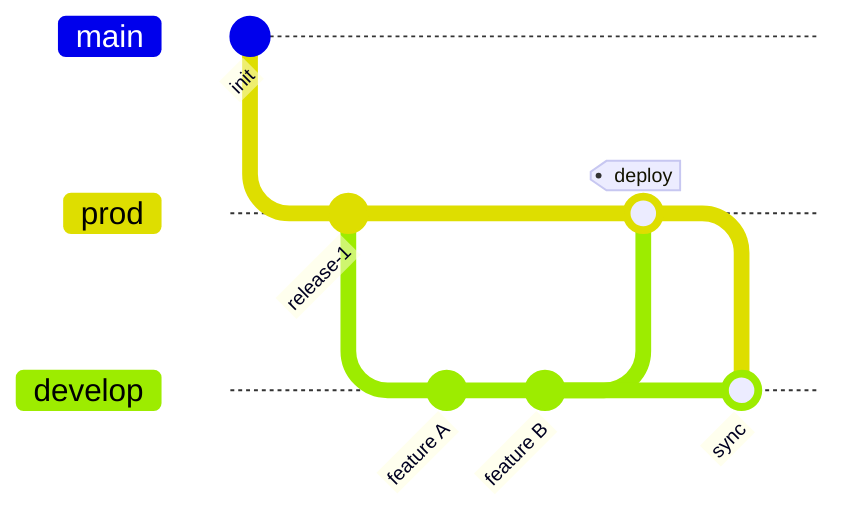
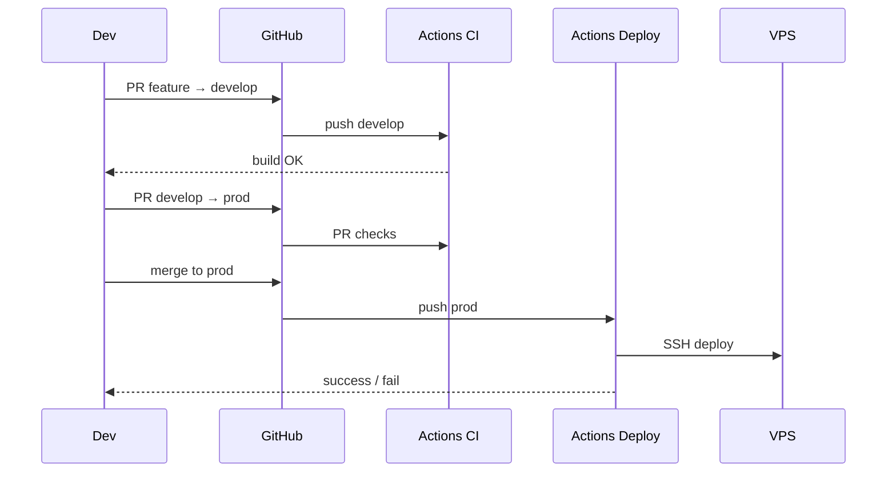

# Деплой StudentPass на VPS: ветки, CI/CD

Пошаговое руководство: ветка **`prod`** — единственный источник деплоя на VPS; **`develop`** — интеграционная ветка для разработки (создаётся от `prod` и регулярно синхронизируется с ней). На push в `prod` GitHub Actions собирает проект и выкатывает его на сервер по SSH.

---

## Содержание

1. [Схема веток](#1-схема-веток)
2. [Первоначальная настройка GitHub](#2-первоначальная-настройка-github)
3. [Защита веток (branch protection)](#3-защита-веток-branch-protection)
4. [Ежедневная работа разработчика](#4-ежедневная-работа-разработчика)
5. [Релиз: develop → prod → VPS](#5-релиз-develop--prod--vps)
6. [Подготовка VPS (один раз)](#6-подготовка-vps-один-раз)
7. [Секреты GitHub](#7-секреты-github)
8. [Файлы CI/CD в репозитории](#8-файлы-cicd-в-репозитории)
9. [Production-конфиги](#9-production-конфиги)
10. [Первый деплой](#10-первый-деплой)
11. [Откат и hotfix](#11-откат-и-hotfix)
12. [Чеклист](#12-чеклист)
13. [Устранение неполадок](#13-устранение-неполадок)

---

## 1. Схема веток



| Ветка | Назначение | Деплой на VPS |
|-------|------------|---------------|
| **`prod`** | Стабильная продакшен-версия | **Да** (только она) |
| **`develop`** | Интеграция фич, тестирование | Нет |
| **`feature/*`** | Отдельные задачи | Нет |
| **`main`** | Можно оставить как архив или удалить после миграции | Нет |

**Правило:** на VPS попадает только то, что есть в `origin/prod` после успешного GitHub Actions.

### Откуда «наследуется» develop

- **При создании:** `develop` создаётся **от** `prod` (один раз).
- **Постоянно:** после каждого релиза в `prod` изменения **вливаются обратно** в `develop`, чтобы ветки не разъезжались.

---

## 2. Первоначальная настройка GitHub

У вас локально уже есть `prod`, `develop`, `main`. Ниже — приведение удалённого репозитория к нужной схеме.

### 2.1. Опубликовать `prod` на GitHub

```bash
cd /path/to/studentpass

# Убедитесь, что prod содержит то, что хотите считать продакшеном
git checkout prod
git pull origin prod 2>/dev/null || true

# Если prod ещё не на remote:
git push -u origin prod
```

### 2.2. Пересоздать `develop` от `prod` (если develop ушёл от main)

**Внимание:** это перепишет историю `develop` на remote. Согласуйте с командой.

```bash
git checkout prod
git pull origin prod

# Локально: develop = копия prod
git branch -D develop 2>/dev/null || true
git checkout -b develop prod

git push -u origin develop --force-with-lease
```

Без `--force`, если `develop` на remote уже совпадает с нужной базой:

```bash
git checkout develop
git merge prod
git push origin develop
```

### 2.3. Default branch на GitHub

1. Репозиторий → **Settings** → **General** → **Default branch**.
2. Установите **`develop`** — новые PR по умолчанию идут в develop, не в prod.
3. Ветку **`main`** можно оставить или удалить на GitHub, если она больше не нужна (Settings → Branches → удалить только после переноса default на develop).

### 2.4. Синхронизация prod → develop после настройки

```bash
git checkout develop
git merge origin/prod
git push origin develop
```

---

## 3. Защита веток (branch protection)

**Settings → Branches → Add branch protection rule**

### Ветка `prod`

| Опция | Рекомендация |
|-------|----------------|
| Require a pull request before merging | Включить |
| Require approvals | 1 (если работаете вдвоём+) |
| Require status checks to pass | Включить после появления CI (`ci` workflow) |
| Require branches to be up to date | По желанию |
| Do not allow bypassing | Включить |
| Restrict who can push | Только maintainers / никто напрямую — только через PR |
| Allow force pushes | **Выключить** |
| Allow deletions | **Выключить** |

### Ветка `develop`

| Опция | Рекомендация |
|-------|----------------|
| Require PR | По желанию (для соло можно мягче) |
| Require status checks | Включить (`CI` job) |
| Allow force pushes | Выключить |

**Итог:** в `prod` нельзя пушить «мимо» проверок; деплой срабатывает только после merge PR (или прямого push, если защита не включена — лучше включить).

---

## 4. Ежедневная работа разработчика

```bash
# Актуализировать develop от prod (перед новой фичей)
git checkout develop
git pull origin develop
git merge origin/prod

# Фича
git checkout -b feature/catalog-filters
# ... коммиты ...
git push -u origin feature/catalog-filters
```

На GitHub: **Pull Request** `feature/...` → **`develop`**.

После merge PR в `develop` срабатывает workflow **CI** (сборка, без деплоя).

---

## 5. Релиз: develop → prod → VPS

Когда develop готов к выкладке:

1. **Pull Request** `develop` → **`prod`**.
2. Code review, дождаться зелёного CI.
3. **Merge** (лучше *Squash and merge* или *Merge commit* — зафиксируйте один стиль в команде).
4. GitHub Actions **Deploy Prod** запускается на `push` в `prod`.
5. Синхронизировать develop с prod:

```bash
git checkout develop
git pull origin develop
git merge origin/prod
git push origin develop
```



---

## 6. Подготовка VPS (один раз)

Пример: Ubuntu 22.04/24.04, домен `studentpass.example.com`, пользователь `deploy`.

### 6.1. Пакеты

```bash
sudo apt update
sudo apt install -y git curl ufw

# Docker
curl -fsSL https://get.docker.com | sudo sh
sudo usermod -aG docker deploy

# Node.js 20 LTS (сборка фронта на сервере при деплое)
curl -fsSL https://deb.nodesource.com/setup_20.x | sudo -E bash -
sudo apt install -y nodejs

# Nginx + Certbot
sudo apt install -y nginx certbot python3-certbot-nginx
```

### 6.2. Пользователь и каталог приложения

```bash
sudo adduser --disabled-password --gecos "" deploy
sudo mkdir -p /opt/studentpass
sudo chown deploy:deploy /opt/studentpass
```

### 6.3. SSH-ключ для GitHub Actions

**На своей машине** (не на VPS):

```bash
ssh-keygen -t ed25519 -C "github-actions-studentpass" -f ./studentpass_deploy_key -N ""
```

- Публичный ключ `studentpass_deploy_key.pub` → на VPS:

```bash
sudo -u deploy mkdir -p /home/deploy/.ssh
sudo -u deploy nano /home/deploy/.ssh/authorized_keys
# вставить содержимое .pub
sudo chmod 700 /home/deploy/.ssh
sudo chmod 600 /home/deploy/.ssh/authorized_keys
```

- Приватный ключ → секрет GitHub `VPS_SSH_KEY` (см. ниже).

Проверка:

```bash
ssh -i ./studentpass_deploy_key deploy@YOUR_VPS_IP "echo OK"
```

### 6.4. Клонирование репозитория на VPS

```bash
sudo -u deploy bash -lc '
  cd /opt/studentpass
  git clone https://github.com/YOUR_ORG/studentpass.git .
  git checkout prod
'
```

Для **приватного** репо на VPS лучше deploy key (read-only) или `git pull` только через CI (репозиторий обновляет Actions по SSH — см. скрипт деплоя).

**Вариант A (проще):** на VPS лежит клон; CI по SSH делает `git fetch && git reset --hard origin/prod` и пересборку.

**Вариант B:** CI только копирует артефакты (rsync `dist/` + `docker compose pull`). Для этого проекта удобнее **вариант A**.

### 6.5. Секреты на VPS (`backend/.env`)

```bash
sudo -u deploy nano /opt/studentpass/backend/.env
```

Пример (значения замените):

```env
MYSQL_ROOT_PASSWORD=...
MYSQL_PASSWORD=...
JWT_SECRET_KEY=...   # openssl rand -base64 48
JWT_ALGORITHM=HS256
ACC_TOKEN_EXP_MIN=60
```

Файл **не коммитить** в git.

### 6.6. Production Docker Compose

Создайте на сервере (или закоммитьте в репо) `backend/docker-compose.prod.yml`:

```yaml
services:
  mysql:
    image: mysql:8.4
    environment:
      MYSQL_ROOT_PASSWORD: ${MYSQL_ROOT_PASSWORD}
      MYSQL_DATABASE: studentpass
      MYSQL_USER: studentpass
      MYSQL_PASSWORD: ${MYSQL_PASSWORD}
    volumes:
      - mysql_data:/var/lib/mysql
    healthcheck:
      test: ["CMD-SHELL", "mysql -h127.0.0.1 -P3306 -ustudentpass -p$$MYSQL_PASSWORD -e 'SELECT 1' studentpass || exit 1"]
      interval: 5s
      timeout: 5s
      retries: 15
      start_period: 40s
    restart: unless-stopped
    # Без ports — MySQL только внутри Docker-сети

  api:
    build:
      context: .
      dockerfile: StudentPass.Api/Dockerfile
    ports:
      - "127.0.0.1:8080:8080"
    environment:
      ASPNETCORE_ENVIRONMENT: Production
      ASPNETCORE_URLS: http://+:8080
      ConnectionStrings__Default: Server=mysql;Port=3306;Database=studentpass;User=studentpass;Password=${MYSQL_PASSWORD};
      Jwt__SecretKey: ${JWT_SECRET_KEY}
      Jwt__Algorithm: ${JWT_ALGORITHM:-HS256}
      Jwt__AccessTokenMinutes: ${ACC_TOKEN_EXP_MIN:-60}
      Cors__Origins: ${CORS_ORIGINS:-https://studentpass.example.com}
    restart: unless-stopped
    depends_on:
      mysql:
        condition: service_healthy

volumes:
  mysql_data:
```

Запуск:

```bash
cd /opt/studentpass/backend
docker compose -f docker-compose.prod.yml --env-file .env up -d --build
```

### 6.7. Nginx

`/etc/nginx/sites-available/studentpass`:

```nginx
server {
    listen 80;
    server_name studentpass.example.com;
    return 301 https://$host$request_uri;
}

server {
    listen 443 ssl http2;
    server_name studentpass.example.com;

    ssl_certificate     /etc/letsencrypt/live/studentpass.example.com/fullchain.pem;
    ssl_certificate_key /etc/letsencrypt/live/studentpass.example.com/privkey.pem;

    root /var/www/studentpass;
    index index.html;

    location / {
        try_files $uri $uri/ /index.html;
    }

    location /api/ {
        proxy_pass http://127.0.0.1:8080;
        proxy_http_version 1.1;
        proxy_set_header Host $host;
        proxy_set_header X-Real-IP $remote_addr;
        proxy_set_header X-Forwarded-For $proxy_add_x_forwarded_for;
        proxy_set_header X-Forwarded-Proto $scheme;
    }
}
```

```bash
sudo ln -s /etc/nginx/sites-available/studentpass /etc/nginx/sites-enabled/
sudo certbot --nginx -d studentpass.example.com
sudo nginx -t && sudo systemctl reload nginx
```

### 6.8. Firewall

```bash
sudo ufw allow OpenSSH
sudo ufw allow 'Nginx Full'
sudo ufw enable
```

---

## 7. Секреты GitHub

**Settings → Secrets and variables → Actions → New repository secret**

| Secret | Пример | Описание |
|--------|--------|----------|
| `VPS_HOST` | `203.0.113.10` | IP или домен VPS |
| `VPS_USER` | `deploy` | SSH-пользователь |
| `VPS_SSH_KEY` | содержимое приватного ключа | Ed25519, весь файл включая `BEGIN/END` |
| `VPS_PORT` | `22` | Опционально (если не 22) |
| `VPS_APP_PATH` | `/opt/studentpass` | Корень клона репозитория |

Для **приватного** репозитория, если на VPS нужен `git pull` без интерактива:

| Secret | Описание |
|--------|----------|
| `VPS_GIT_DEPLOY_KEY` | Отдельный read-only deploy key для `git fetch` на VPS (опционально, если не используете HTTPS с токеном) |

---

## 8. Файлы CI/CD в репозитории

Создайте в корне репозитория следующие файлы (можно скопировать из этого раздела).

### 8.1. `.github/workflows/ci.yml` — проверки без деплоя

Срабатывает на PR и push в **`develop`** (и опционально в `feature/*` через PR).

```yaml
name: CI

on:
  push:
    branches: [develop]
  pull_request:
    branches: [develop, prod]

jobs:
  build:
    runs-on: ubuntu-latest
    steps:
      - uses: actions/checkout@v4

      - name: Setup Node.js
        uses: actions/setup-node@v4
        with:
          node-version: "20"
          cache: npm
          cache-dependency-path: frontend/package-lock.json

      - name: Build frontend
        working-directory: frontend
        run: |
          npm ci
          npm run build
        env:
          VITE_DEV_AUTH_ROLE: off
          VITE_API_BASE_URL: ""

      - name: Setup .NET
        uses: actions/setup-dotnet@v4
        with:
          dotnet-version: "10.0.x"

      - name: Build API
        working-directory: backend/StudentPass.Api
        run: dotnet build -c Release --no-restore
        # restore отдельно при необходимости:
        # run: dotnet restore && dotnet build -c Release

      - name: Verify Docker build (API image)
        working-directory: backend
        run: docker build -f StudentPass.Api/Dockerfile -t studentpass-api:ci .
```

### 8.2. `.github/workflows/deploy-prod.yml` — **только `prod` → VPS**

```yaml
name: Deploy Prod

on:
  push:
    branches: [prod]
  workflow_dispatch:

concurrency:
  group: deploy-prod
  cancel-in-progress: false

jobs:
  deploy:
    runs-on: ubuntu-latest
    environment: production
    steps:
      - uses: actions/checkout@v4

      - name: Deploy over SSH
        uses: appleboy/ssh-action@v1.2.0
        with:
          host: ${{ secrets.VPS_HOST }}
          username: ${{ secrets.VPS_USER }}
          key: ${{ secrets.VPS_SSH_KEY }}
          port: ${{ secrets.VPS_PORT || 22 }}
          script_stop: true
          script: |
            set -euo pipefail
            APP_PATH="${{ secrets.VPS_APP_PATH }}"
            cd "$APP_PATH"

            echo ">>> Fetch prod"
            git fetch origin prod
            git checkout prod
            git reset --hard origin/prod

            echo ">>> Backend (Docker)"
            cd backend
            docker compose -f docker-compose.prod.yml --env-file .env up -d --build

            echo ">>> Frontend build"
            cd ../frontend
            npm ci
            npm run build
            sudo mkdir -p /var/www/studentpass
            sudo rsync -a --delete dist/ /var/www/studentpass/

            echo ">>> Health check"
            sleep 5
            curl -fsS http://127.0.0.1:8080/api/v1/health

            echo ">>> Done"
        env:
          # Переменные для npm build на VPS (если нужны)
          VITE_DEV_AUTH_ROLE: off
          VITE_API_BASE_URL: ""
```

**Важно:**

- Workflow **не** запускается на `develop` — только на `prod`.
- `environment: production` в GitHub позволяет включить **required reviewers** перед деплоем (Settings → Environments → production).

### 8.3. `scripts/deploy-vps.sh` (опционально, тот же сценарий вручную)

Положите в репозиторий и вызывайте на VPS после `git pull`:

```bash
#!/usr/bin/env bash
set -euo pipefail
ROOT="$(cd "$(dirname "$0")/.." && pwd)"
cd "$ROOT"

git fetch origin prod
git checkout prod
git reset --hard origin/prod

cd backend
docker compose -f docker-compose.prod.yml --env-file .env up -d --build

cd ../frontend
npm ci
npm run build
sudo mkdir -p /var/www/studentpass
sudo rsync -a --delete dist/ /var/www/studentpass/

curl -fsS http://127.0.0.1:8080/api/v1/health
echo "Deploy OK"
```

```bash
chmod +x scripts/deploy-vps.sh
```

### 8.4. Environment `production` в GitHub (опционально)

1. **Settings → Environments → New environment** → `production`.
2. **Deployment branches:** только `prod`.
3. **Required reviewers** — кто должен подтверждать деплой перед запуском job.

---

## 9. Production-конфиги

### 9.1. `frontend/.env.production`

Закоммитьте в репозиторий:

```env
VITE_DEV_AUTH_ROLE=off
VITE_API_BASE_URL=
```

Пустой `VITE_API_BASE_URL` — запросы идут на тот же домен (`/api/...` через Nginx).

### 9.2. CORS в API

В `Program.cs` добавьте прод-домен или читайте из `Cors__Origins` (переменная в `docker-compose.prod.yml`):

```csharp
var corsOrigins = builder.Configuration["Cors:Origins"]?
  .Split(',', StringSplitOptions.RemoveEmptyEntries | StringSplitOptions.TrimEntries)
  ?? new[] { "http://localhost:5173" };

policy.WithOrigins(corsOrigins)
```

При схеме «один домен + Nginx proxy» CORS менее критичен, но для cookie/credentials лучше указать точный `https://ваш-домен`.

### 9.3. Secure cookies

В `AuthController` для Production:

```csharp
Secure = app.Environment.IsProduction(),
```

(или всегда `true` на VPS с HTTPS).

### 9.4. Права `sudo` для `deploy` (только rsync в /var/www)

```bash
sudo visudo -f /etc/sudoers.d/deploy-studentpass
```

```
deploy ALL=(ALL) NOPASSWD: /bin/mkdir, /usr/bin/rsync
```

Уточните пути (`which rsync`, `which mkdir`).

---

## 10. Первый деплой

1. Закоммитьте в репозиторий:
   - `.github/workflows/ci.yml`
   - `.github/workflows/deploy-prod.yml`
   - `backend/docker-compose.prod.yml`
   - `frontend/.env.production`
   - `scripts/deploy-vps.sh` (опционально)
2. Настройте VPS (раздел 6) и секреты GitHub (раздел 7).
3. Влейте эти файлы в `develop`, затем PR **`develop` → `prod`**.
4. После merge смотрите **Actions → Deploy Prod**.
5. Откройте `https://studentpass.example.com` и `https://studentpass.example.com/api/v1/health`.

---

## 11. Откат и hotfix

### Откат prod на предыдущий коммит

```bash
git checkout prod
git pull origin prod
git log --oneline -5
git revert HEAD   # или git reset --hard <good-commit> (осторожно)
git push origin prod
```

Push в `prod` снова запустит деплой.

### Hotfix (срочный фикс в прод)

```bash
git checkout prod
git pull origin prod
git checkout -b hotfix/fix-login
# ... fix ...
git push -u origin hotfix/fix-login
```

PR **`hotfix/...` → `prod`** → после merge:

```bash
git checkout develop
git merge origin/prod
git push origin develop
```

---

## 12. Чеклист

### GitHub

- [ ] `prod` и `develop` на remote, `develop` создан/синхронизирован от `prod`
- [ ] Default branch = `develop`
- [ ] Protection на `prod` (PR + CI)
- [ ] Секреты `VPS_*` заданы
- [ ] Workflows `ci.yml` и `deploy-prod.yml` в репозитории
- [ ] Environment `production` (по желанию)

### VPS

- [ ] Docker, Node 20, Nginx, SSL
- [ ] Пользователь `deploy`, SSH-ключ Actions
- [ ] Клон в `/opt/studentpass`, ветка `prod`
- [ ] `backend/.env` с сильными паролями
- [ ] `docker-compose.prod.yml`, MySQL без публичного порта
- [ ] Nginx: статика + `/api/` → `127.0.0.1:8080`
- [ ] UFW: 22, 80, 443

### Код

- [ ] `frontend/.env.production` (`VITE_DEV_AUTH_ROLE=off`)
- [ ] CORS / Secure cookies для HTTPS
- [ ] `.env` в `.gitignore`

---

## 13. Устранение неполадок

| Симптом | Что проверить |
|---------|----------------|
| Deploy не запускается | Push именно в `prod`? Workflow файл в ветке `prod`? |
| `Permission denied (publickey)` | `VPS_SSH_KEY`, `authorized_keys` на VPS |
| `git reset` не находит ветку | На VPS: `git remote -v`, доступ к GitHub |
| `npm: command not found` | Node.js на VPS |
| `docker compose` fails | `backend/.env`, логи: `docker compose -f docker-compose.prod.yml logs` |
| 502 на `/api/` | API слушает `127.0.0.1:8080`, `curl localhost:8080/api/v1/health` |
| Фронт без данных | `VITE_API_BASE_URL` при сборке, Nginx `location /api/` |
| Cookies не работают | HTTPS, `Secure=true`, один домен для сайта и API |
| CI падает на `dotnet` | Версия SDK 10 в workflow и в `csproj` |

Логи деплоя: GitHub → **Actions** → run → шаг **Deploy over SSH**.

Логи на VPS:

```bash
cd /opt/studentpass/backend
docker compose -f docker-compose.prod.yml logs -f api
sudo tail -f /var/log/nginx/error.log
```

---

## Краткая шпаргалка

```text
feature/*  ──PR──►  develop  ──PR──►  prod  ──push──►  GitHub Actions  ──SSH──►  VPS
                         │                │
                         └── CI only       └── Deploy only
```

**На VPS всегда только содержимое ветки `prod`.**
